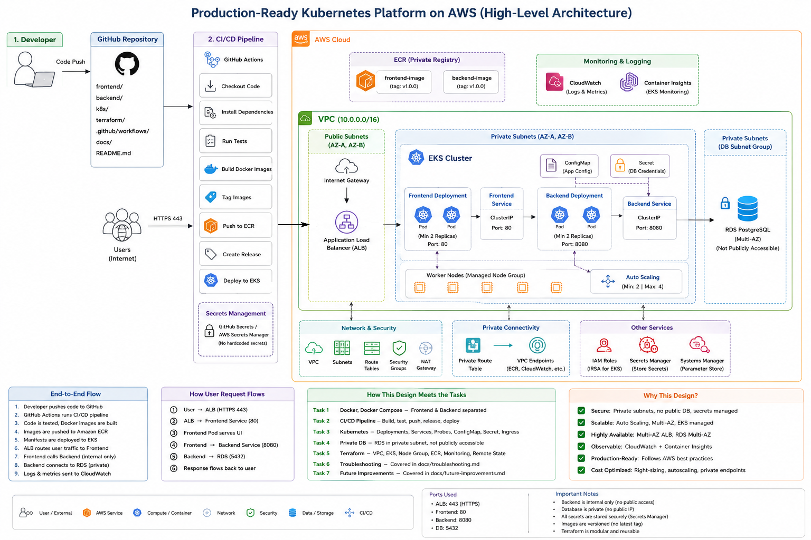

# DevOps Platform — Production-Style Kubernetes Platform on AWS

A small but production-shaped platform: a frontend + backend app,
containerized, tested, built and released through CI/CD, deployed to EKS
via custom Terraform modules, with a private RDS database.

## Architecture



*How a deploy travels from `git push` to a running pod, and how a real user
request travels from the browser to the database and back — including where
the security boundaries sit.*

```
🌍 Users ──▶ ALB ──▶ Frontend (public) ──▶ Backend (private) ──▶ RDS (private)
                                                                     ▲
👨‍💻 Dev ──▶ GitHub ──▶ CI/CD ──▶ ECR ──▶ EKS ─────────────────────────┘
```

---

## 🛠️ Summary of completed work

### Docker & local Compose setup
- Express backend on port 8080 with `/` and `/health` endpoints; Nginx frontend.
- Multi-stage Docker builds, non-root runtime users, minimal Alpine-based images.
- Single-command local orchestration via `docker-compose.yml` (`docker compose up -d`).

### CI/CD pipeline
- GitHub Actions workflow triggered on push to `main`.
- Runs tests, builds and tags both images with the commit SHA (never `latest`),
  authenticates to AWS via OIDC (no static keys in GitHub Secrets), pushes to
  ECR, cuts a GitHub Release, and rolls out the new image tag to EKS.
- ECR push and the EKS deploy step both fall back to a clearly-labeled mock
  when AWS infrastructure/secrets aren't configured yet, so the pipeline runs
  end-to-end from day one.

### Kubernetes orchestration
- Two replicas minimum per service, rolling updates with zero unavailability.
- CPU/memory `requests` and `limits` set on every container.
- Liveness and readiness HTTP probes for self-healing and safe traffic cutover.
- ALB Ingress exposes the frontend only; the backend Service is `ClusterIP`
  with no Ingress rule pointing at it — unreachable from outside the cluster.

### Private database
- RDS lives only in private subnets, `publicly_accessible = false`.
- Security group allows the database port from the EKS node security group
  only — nothing else, no `0.0.0.0/0` rule anywhere.
- Master password is AWS-managed (`manage_master_user_password = true`) and
  stored in Secrets Manager — Terraform and CI never see the plaintext.

### Terraform (Infrastructure as Code)
- 100% custom modules (`vpc`, `ecr`, `eks`, `rds`, `monitoring`) — no
  third-party/registry modules.
- Remote state in S3 with DynamoDB locking, so two applies can never run
  concurrently and corrupt state.
- Separate `.tfvars`/backend config per environment (`dev`, `prod`).

---

## Where everything lives

| Looking for... | Go to |
|---|---|
| The actual app code | `frontend/`, `backend/` |
| How to run it locally | `docker-compose.yml`, "Running locally" below |
| The CI/CD pipeline | `.github/workflows/deploy.yml` |
| Kubernetes manifests | `k8s/` |
| Cloud infrastructure code | `terraform/` — start with `terraform/README.md` |
| How the database stays private | `terraform/README.md` → "Private Database Connectivity" |
| Upgrade/state/scaling operations | `terraform/README.md` → "Terraform Maintenance & Operations" |
| Incident response playbook | `docs/troubleshooting.md` |
| What's intentionally not done yet, and why | `docs/future-improvements.md` |
| Architecture diagrams | `docs/architecture-flow.png` |

## Repository structure

```
.
├── backend/                  # Express API - /, /health, /api/info (port 8080)
│   ├── src/app.js  server.js
│   ├── tests/                # Jest + supertest
│   └── Dockerfile             # multi-stage, non-root, HEALTHCHECK
├── frontend/                  # static page served by nginx, proxies /api/*
│   ├── public/index.html
│   ├── tests/                  # sanity checks + htmlhint
│   └── Dockerfile
├── docker-compose.yml           # local dev: frontend :3000, backend :8080
├── .dockerignore / .gitignore
├── .github/workflows/
│   └── deploy.yml                 # test -> build -> tag -> push -> release -> deploy
├── k8s/                             # Kubernetes manifests
│   ├── namespace.yaml
│   ├── backend-deployment.yaml / backend-service.yaml
│   ├── frontend-deployment.yaml / frontend-service.yaml
│   ├── backend-configmap.yaml
│   ├── backend-secret-example.yaml  # template only, not a real secret
│   └── ingress.yaml
├── terraform/                        # AWS infra, custom modules only
│   ├── provider.tf  main.tf  variables.tf  outputs.tf
│   ├── environments/                  # dev / prod tfvars + backend config
│   ├── modules/vpc  ecr  eks  rds  monitoring/
│   └── README.md                        # private DB + Terraform ops explained
└── docs/
    ├── architecture-simple.mermaid       # high-level diagram
    ├── architecture-flow.mermaid           # detailed, numbered request/deploy flow
    ├── troubleshooting.md                    # 15 incident-response scenarios
    └── future-improvements.md                  # 16 improvements, each with why/how/risk
```

## Running locally

```bash
docker compose up -d --build
curl http://localhost:8080/           # Application is running
curl http://localhost:8080/health     # {"status":"ok"}
# frontend: http://localhost:3000
```

## Running tests

```bash
cd backend && npm ci && npm test
cd frontend && npm ci && npm test
```

## CI/CD secrets (once real AWS infra exists)

Add under **Settings → Secrets and variables → Actions**:

| Name | Type | Notes |
|---|---|---|
| `AWS_ROLE_ARN` | Secret | IAM role assumed via OIDC — no long-lived AWS keys stored in GitHub at all |
| `EKS_CLUSTER_NAME` | Secret | from `terraform output cluster_name` |
| `AWS_REGION` | Variable | e.g. `ap-southeast-1` |
| `ECR_REPO_BACKEND` / `ECR_REPO_FRONTEND` | Variable | from `terraform output ecr_repository_urls` |

Until these exist, `deploy.yml` runs the ECR push and EKS deploy steps as a
clearly-labeled mock — nothing breaks, nothing silently no-ops.

## Pushing this to GitHub

```bash
cd devops-platform
git init
git add .
git commit -m "Production-style Kubernetes platform on AWS"
git branch -M main
git remote add origin <your-empty-github-repo-url>
git push -u origin main
```

Then, once real AWS infra is provisioned (`cd terraform && terraform apply`),
add the 4 secrets/variables above under repo Settings, and the next push to
`main` does a real ECR push + EKS deploy automatically.